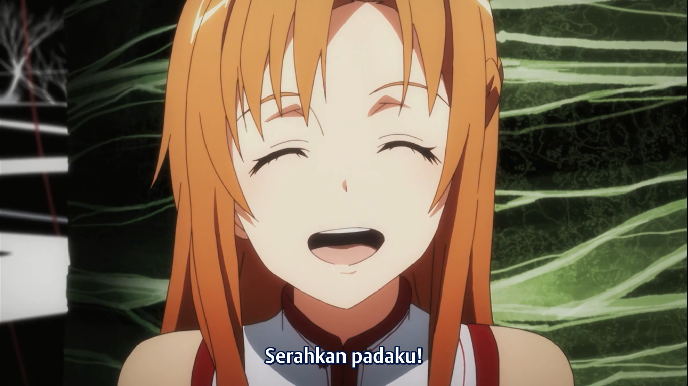

# Basic Syntax

## Overview

Hampir semua aplikasi markdown mendukung sintax dasar markdown dari dokumentasi desain original John Gruber.

## Headings

Headings (pada HTML, `<h_>` ), menggunakan tanda pagar (#) untuk membuat heading. banyaknya tanda pagar menandakan heading berapa

**Main:**

``` MARKDOWN
# Heading 1
```

# Heading 1

``` MARKDOWN
## Heading 2
```

## Heading 2

``` MARKDOWN
### Heading 3
```

### Heading 3

dst

**Alternative:**

``` MARKDOWN
Heading 1
===
```

Heading 1
===

``` MARKDOWN
Heading 2
---
```

Heading 2
---

<br>

Untuk menghubungkan text dengan heading, kita bisa memasukkan text heading ditambah tanda pagar di depan kata (huruf kecil, spasi diganti minus)

``` MARKDOWN
[here link to heading 1](#headings)
```

[here link to heading 1](#headings)

<br>

Best practice untuk heading

- Gunakan `# Heading` dengan spasi
- Jangan gunakan `#Heading` tanpa spasi

## Paragraphs

Paragraph ( `<p>` ) menggunakan baris kosong (garis baru) untuk membuat paragraph

``` MARKDOWN
Paragraph 1
(baris kosong)
Paragraph 2

Paragraph 3
```

Paragraph 1

Paragraph 2

Paragraph 3

<br>

Best practice untuk paragraph:

- Jangan menaruh tab atau spasi di depan paragraph, hal ini bisa menyebabkan masalah formating yang tidak diduga.
- Biarkan paragraph berada disebelah kiri

## Line Breaks

Line break ( `<br>` )Untuk membuat line break beri 2 atau lebih spasi di akhir kalimat

``` MARKDOWN
Baris pertama  (2 Spasi)
Baris kedua
```

Baris pertama  
Baris kedua

<br>

Best practice untuk line break:

- 2 spasi/trailing whitespace merupakan cara yang kontroversial, secara spasi sulit dilihat jika kita menggunakan text editor biasa. Maka dari itu kita bisa menggunakan HTML tag `<br>`
- Cara lain dengan menambahkan backslash (\\) diakhir kalimat, namun tidak disarankan karena tidak semua aplikasi mendukung ini
- Dan beberapa aplikasi tidak membutuhkan apapun dibelakang kalimat

## Emphasis

### Bold

bold / `<strong>` menggunakan 2 tanda bintang/garis bawah (** / __) untuk membuat kata menjadi bold

``` MARKDOWN
This is **Bold**  
This too is __Bold__  
Love**is**bold
```

This is **Bold**  
This too is __Bold__  
Love**is**bold

### Italic

Untuk menambahkan italic/`<em>` gunakan 1 tanda bintang / garis bawah (* / _)

``` MARKDOWN
sangat *distinctive*  
ini juga sangat _distinctive_  
A*cat*meow
```

sangat *distinctive*  
ini juga sangat _distinctive_  
A*cat*meow

### Bold and Italic

Tambahkan 3 tanda bintang atau garis bawah untuk membuat kata menjadi bold dan italic

``` MARKDOWN
this is really ***important***  
this too is really ___important___  
realy***really*** important
```

this is really ***important***  
this too is really ___important___  
realy***really*** important

<br>

Best practice untuk emphasis:

- Gunakan tanda bintang sama seperti bold juga italic

### Blockquotes

Tambahkan tanda lebih besar (>) di depan paragraph

``` MARKDOWN
> I'm Handsome
```

> I'm Handsome

Blockquote juga bisa beris beberapa paragraph, seperti:

``` MARKDOWN
> I'm Handsome
>
> Absolutly right
```

> I'm Handsome
>
> Absolutly right

Nested blockquote:

``` MARKDOWN
> I'm Handsome
>> Isn't I?
```

> I'm Handsome
>> Isn't I?

Catatan:

- Blockquote bisa berisi element lain seperti header maupun emphasis

## Lists

### Ordered Lists

Untuk membuat ordered list (`<li>`), kita menggunakan angka diikuti dengan tanda titik. angkanya tidak perlu berurutan yang penting angka pertama dimulai dari 1

``` MARKDOWN
1. one
2. two
3. three
4. four
```

1. one
2. two
3. three
4. four

### Unordered Lists

Untuk membuat unordered list (`<ul>`), gunakan tanda kurang (-), tanda bintang (*), atau tanda tambah (+)

``` MARKDOWN
- one
- two
- three
- four
```

- one
- two
- three
- four

### Nested List

Gunakan indentasi 1 atau lebih untuk membuat nested list

``` MARKDOWN
- one
- two
- three
  - three indent 1 one
  - three indent 1 two
    - indent 2
- four
```

- one
- two
- three
  - three indent 1 one
  - three indent 1 two
    - indent 2
- four

Catatan:

- Jika kita ingin membuat unordered list dengan angka diikuti tanda titik, kita bisa menggunakan backslash (\\) untuk mencetak tanda titik tersebut
- Unordered list bisa mencetak sampai 3 indent (bentuk berbeda)
- Untuk menambahkan elemen lain pada sebuah list dengan mempertahankan kelanjutan list tersebut, gunakan tab setelah tanda list

``` MARKDOWN
1. one
   -  unorderlist
   -  unorderlist
1. two
   > hi there
1. three  
   do something here
1. four
```

1. one
   - unorderlist
   - unorderlist
2. two
   > hi there
3. three  
   do something here
4. four

<br>

Best practice untuk list:

- Gunakan 1 tanda saja untuk 1 list yang sama. pilih 1 dan tetap dengan pilhan itu
- Untuk membuat indentasi gunakan tab

## Code

Untuk membuat sebuah kata atau kalimant menjadi kode (`<code>`), kita menggunakan backticks ( ` )

``` MARKDOWN
`int`
```

`int`

Jika sebuah kalimat yang ingin kita masukkan berisi backtick juga, kita bisa mengeluarkannya menggunakan backtick ganda ( `` )

``` MARKDOWN
``Use `code` in your Markdown file``
```

``Use `code` in your Markdown file``

### Fenced Code Blocks

Dalam pembuatan kode biasanya lebih dari 1 baris. Jadi kita bisa menggunakan Fenced Code Blocks. Gunakan 3 backtick atau 3 tild untuk membuat fenced code block

```` MARKDOWN
``` BAHASA PEMROGRAMAN
Code
```
````

``` BAHASA PEMROGRAMAN
Code
```

<br>

``` MARKDOWN
~~~
this
will
do too
~~~
```

~~~
this
will
do too
~~~

<br>

Best practice:

- Biasakan menggunakan backtick ( ` ) daripada tild ( ~ )
- Tulis jenis bahasa pemrograman yang digunakan, pada fenced code block
- Gunakan pasangan backtick yang sama 3 backtick dengan 3 backtick, 4 dengan 4, dst. Hal ini berlaku pada penulisan inline code maupun fenced code

## Horizontal Rule

Untuk membuat garis horizontal gunakan 3 atau lebih tanda bintang (***), 3 atau lebih tanda kurang (---), atau 3 atau lebih garis bawah (___)

``` MARKDOWN
---

***

___

```

---

***

___

<br>

Best practice

- Tambahkan sebuah baris kosong sebelum dan sesudah horizontal rule

## Links

Untuk membuat links `<href>` gunakan kurung siku ( [] ) pada kata/kalimat yang akan dijadikan link dan kemudian diikuti dengan URLnya dengan kurung biasa ( () )

``` MARKDOWN
I like to watch [YouTube](https://www.youtube.com/)
```

I like to watch [YouTube](https://www.youtube.com/)

Kita juga bisa menambahkan judul pada link kita, dengan begitu jika mouse diarahkan pada link, maka akan keluar keterangan tambahan. Untuk menambahkan judul kita bisa menggunakan tanda petik 2 ( " ) setelah URL

``` MARKDOWN
I like to watch [YouTube](https://www.youtube.com/ "Tempat streaming terbaik")
```

I like to watch [YouTube](https://www.youtube.com/ "Tempat streaming terbaik")

Untuk langsung membuat sebuah link polos, kita cukup menggunakan tanda kurang dari dan lebih dari ( <> ). Hal ini berlaku juga untuk email

``` MARKDOWN
<putugedesayoga@gmail.com>  
<https://www.youtube.com>
```

<putugedesayoga@gmail.com>  
<https://www.youtube.com>

**Reference Style Link** biasa digunakan untuk membuat file markdown menjadi lebih mudah dibaca. Link ditaruh disuatu bagian pada file yang tidak mengganggu pembaca. Sehingga kita dapat membaca file markdown tersebut bahkan ketika tidak dirender. Reference style link ini terdiri dari 2 bagian, yaitu:

1. Bagian pertama, tambahkan kurung siku pada kata yang akan dibuat link, diikuti dengan kata kedua dengan kurung siku juga. kata kedua berfungsi untuk merujuk pada bagian kedua
2. Bagian kedua merupakan linknya. pertama, label/penunjuk ditutup dgn kurung siku dan diikuti dengan tanda titik 2 dan paling tidak sebuah spasi. kedua, linknya bisa langsung atau ditutup dengan tanda kurang dari dan lebih dari. ketiga title bisa ditambahkan jika perlu  

``` MARKDOWN
[Youtube][1] merupakan salah satu tempat streaming video yang populer saat ini. Disini kita bisa menonton berbagai hal seperti berita, anime, ilmu dan sebagainya. [Sword Art Online][SAO] merupakan salah satu anime yang layak untuk ditonton
(Baris kosong)
[1]: <https://www.youtube.com> "Tempat streaming video"  
[SAO]: <[putugedesayoga@gmail.com](https://myanimelist.net/anime/11757/Sword_Art_Online?q=sword%20art%20onl&cat=anime)>
```

[Youtube][1] merupakan salah satu tempat streaming video yang populer saat ini. Disini kita bisa menonton berbagai hal seperti berita, anime, ilmu dan sebagainya. [Sword Art Online][SAO] merupakan salah satu anime yang layak untuk ditonton

[1]: <https://www.youtube.com> "Tempat streaming video"  
[SAO]: <https://myanimelist.net/anime/11757/Sword_Art_Online?q=sword%20art%20onl&cat=anime>

Catatan:

- Untuk reference style link, tambahkan sebuah baris kosong agar perubahan bisa terlihat
- Jika ada spasi di tengah-tengah link, ganti dengan %20 untuk kompatibility (standard url)
- Banyak aplikasi markdown secara otomatis merubah link tanpa harus memberi tanda kurang dari dan lebih dari ( <> )
- Untuk menghilangkan link kita bisa menandai link tersebut sebagai kode dengan backticks
   `http://www.example.com`

## Images

Image ``, untuk menambahkan gambar beri tanda seru ( ! ), diikuti dengan kata *alt*-nya dengan kurung siku ( [] ), dan path/url gambar dalam kurung biasa ( () ). kita bisa menambahkan title setelah path gambar

``` MARKDOWN

```


Kita juga bisa menambahkan link pada gambar, tutup syntax gambar dengan kurung siku kemudian diikuti dengan link yang ditutupi kurung biasa (sama seperti memberi link pada tulisan, hanya saja tulisan ini diganti dengan gambar)

``` MARKDOWN
[](https://www.swordart-onlineusa.com/)
```

[](https://www.swordart-onlineusa.com/)

> [Alt text](https://blog.hubspot.com/marketing/image-alt-text), Also called "alt tags" and "alt descriptions", alt text is the written copy that appears in place of an image on a webpage if the image fails to load on a user's screen. This text helps screen-reading tools describe images to visually impaired readers and allows search engines to better crawl and rank your website.

## Escaping Character

Untuk menampilkan karakter yang tidak ingin dipakai sebagai format kita bisa menambahkan backslash ( \\ ). Markdown dapat meng-*escape* karakter-karakter berikut:

- \\     backslash
- \`     backtick
- \*     asterisk
- \_     underscore
- \{\}   curly braces
- \[\]   square brackets
- \(\)   parentheses
- \#     hash mark
- \+     plus sign
- \-     minus sign (hyphen)
- \.     dot
- \!     exclamation mark

Escaping karakter ini juga bisa digunakan untuk menampilkan syntax html:

``` MARKDOWN
\<br/>, tanpa backslash, syntax HTML ini akan dirender
```

\<br/>, tanpa backslash, syntax HTML ini akan dirender


## HTML

Banyak aplikasi markdown mengijinkan kita untuk memasukkan tag HTML. Hal ini sangat membantu jika lebih memilih untuk menggunakan tag HTML dari pada menggunakan markdown. sebagai contoh beberapa orang merasa lebih mudah menggunakan HTML tag untuk gambar. Menggunakan HTML juga membantu ketika kita ingin merubah element, seperti merubah warna tulisan atau merubah panjang/lebar gambar  

``` MARKDOWN
This **word** is bold. This <em>word</em> is italic.
```

This **word** is bold. This <em>word</em> is italic.

<br>

Best practice:

- Tidak semua aplikasi markdown mendukung HTML, cek terlebih dahulu apakah aplikasi yang digunakan mendukung HTML
- Gunakan baris kosong untuk memisahkan HTML dengan element lain. Coba untuk tidak mengindentasi tag HTML dengan spasi atau tab, yang bisa mengganggu dengan formatnya
